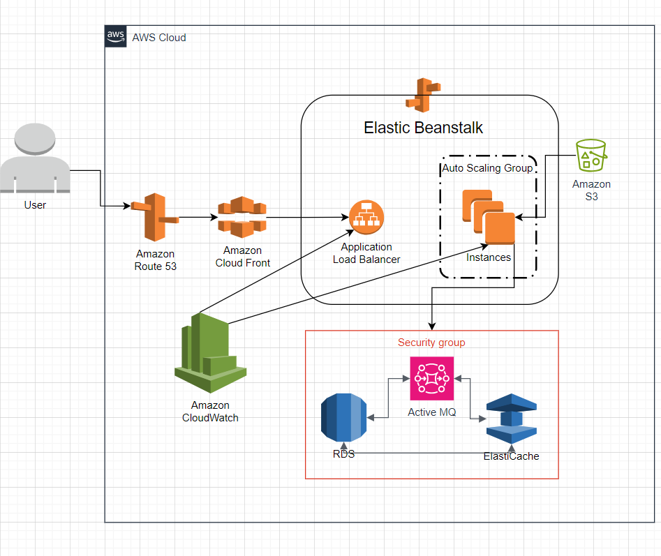

# Project Name
Multi-Tier Web Application (Re-Architecting)

## Brief description of the project
A web application running on a AWS EC2 Instances using the lift & shift strategy. This strategy will Re-Architecting using all AWS Services.

## AWS Services
1. Beanstalk => VM for Tomcat
2. Beanstalk => Nginx LB Replacement
3. Beanstalk => Automation for VM Scaling
4. S3/EFS => Storage
5. RDS Instance => Databases
6. ElastiCache => Memcached Replacement
7. ActiveMQ => RabbitMQ Replacement
8. Route 53 => DNS
9. CloudFront => Content Delivery Network

### Flow of Execution:
1. Login to AWS Account
2. Create Key Pairs
3. Create Security Groups
4. Launch RDS, ElastiCache, ActiveMQ
5. Create Elastic Beanstalk Environment
6. Launc EC2 Instance for DB Initializing
7. Login to the instance and initiliaze RDS DB
8. Change health check on beanstalk to /login
9. Add 443 https Listener to ELB
10. deploy Artifact with Backend Information
11. Deploy Artifact to Beanstalk
12. Create CDN with SSL Certificate
13. Update Entry in GoDaddy DNS Zones
14. Test the URL

## Credits
Special thanks to Sir Imran Teli from Udemy, He's the owner of this project.

## AWS Diagram

